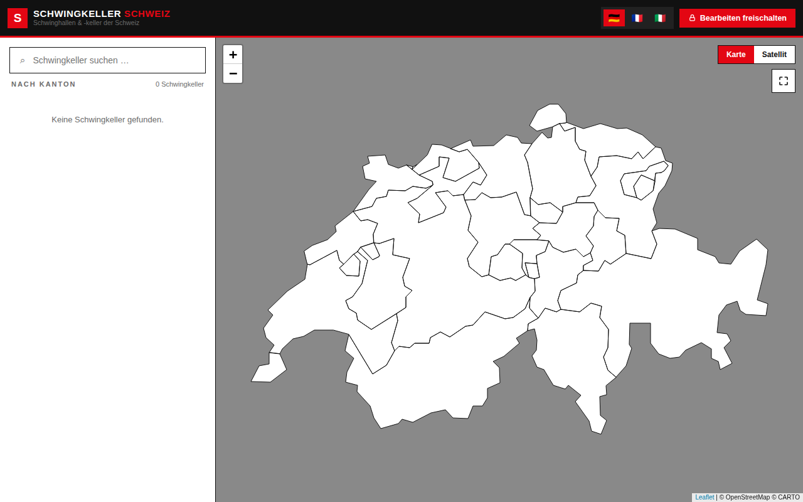

# Schwingkeller Schweiz

[](https://github.com/hoferan/schwingkeller/actions/workflows/ci.yml)
[](https://codecov.io/gh/hoferan/schwingkeller)
[](https://app.netlify.com/sites/FILL_IN_SITE_NAME/deploys)

An interactive map of Swiss **Schwingkeller** — the training cellars and venues of Swiss wrestling
(*Schwingen*). Browse venues clustered on a Leaflet map, filter and search by canton, read venue
details, and — as an authenticated admin — add, edit and delete venues with photo uploads, address
geocoding and pick-on-map coordinate entry. The app is a static single-page application backed by
Supabase, available in German, French and Italian.



## Features

- **Interactive clustered map** — Leaflet map with marker clustering that expands as you zoom in.
- **Canton grouping & mask** — venues grouped by Swiss canton; a mask dims everything outside the
  Swiss borders to keep focus on the country.
- **Trilingual UI (DE / FR / IT)** — full i18n with a language switcher.
- **Search** — filter venues by name, town or canton from the sidebar.
- **Venue detail** — a detail view with photo, address, description and a directions link.
- **Admin CRUD** — authenticated users can add, edit and delete venues, including:
  - **Photo upload** to the `venue-photos` Supabase Storage bucket.
  - **Address geocoding** via Nominatim (OpenStreetMap).
  - **Pick-on-map** coordinate entry for venues without a precise address.
- **CSV / JSON import & export** — bulk-manage the venue dataset.
- **Sentry error tracking** — runtime errors are reported to Sentry in production.

## Tech stack

| Area              | Technology                                                              |
| ----------------- | ----------------------------------------------------------------------- |
| Build tool        | [Vite](https://vitejs.dev/)                                             |
| UI framework      | [React 19](https://react.dev/) + [TypeScript](https://www.typescriptlang.org/) |
| Map               | [Leaflet](https://leafletjs.com/), [react-leaflet](https://react-leaflet.js.org/), [leaflet.markercluster](https://github.com/Leaflet/Leaflet.markercluster) |
| Backend           | [Supabase](https://supabase.com/) (Postgres + Auth + Storage, with RLS) |
| Data fetching     | [@tanstack/react-query](https://tanstack.com/query)                     |
| Error tracking    | [@sentry/react](https://sentry.io/)                                     |
| Geocoding         | [Nominatim](https://nominatim.org/) (OpenStreetMap)                     |
| Testing           | [Vitest](https://vitest.dev/) + [React Testing Library](https://testing-library.com/) |
| Linting / format  | [ESLint](https://eslint.org/) + [Prettier](https://prettier.io/)        |
| Local backend     | [Supabase CLI](https://supabase.com/docs/guides/cli) (Docker)           |
| Containerization  | [Docker Compose](https://docs.docker.com/compose/)                      |
| Hosting           | [Netlify](https://www.netlify.com/)                                     |
| CI / coverage     | [GitHub Actions](https://docs.github.com/actions) + [Codecov](https://codecov.io/) |

## Architecture

A static Vite + React SPA. All persistent state lives in Supabase: a Postgres `venues` table
protected by Row Level Security (public read, authenticated write) and a `venue-photos` Storage
bucket for images. The browser talks to Supabase directly using the publishable key; there is no
custom backend server. React Query manages server state and caching, an auth provider wraps the
Supabase session, and feature folders under `src/features/` group UI and logic by domain.

```text
src/
├── lib/
│   ├── supabase.ts            # Supabase client (URL + publishable key)
│   └── sentry.ts              # Sentry initialization
├── data/
│   ├── cantons.ts             # Swiss canton metadata
│   └── plzRanges.ts           # postal-code → canton ranges
├── i18n/
│   ├── translations.ts        # DE / FR / IT dictionaries
│   └── useTranslation.ts      # translation hook
├── features/
│   ├── auth/                  # AuthProvider, useAuth, LoginModal
│   ├── venues/                # types, api, useVenues, geocoding, importExport, grouping
│   ├── map/                   # MapView, markers
│   ├── sidebar/               # Sidebar
│   ├── venue-detail/          # DetailModal
│   └── venue-edit/            # EditForm
├── components/
│   ├── Topbar.tsx
│   └── Modal.tsx
├── App.tsx
├── main.tsx
└── index.css
```

Supabase schema and seed data live under `supabase/`:

- `supabase/migrations/0001_init.sql` — creates the `venues` table, its RLS policies, the
  `venue-photos` Storage bucket and the bucket's storage policies.
- `supabase/seed.sql` — seeds 8 example venues for local development.

## Prerequisites

- **[Docker](https://docs.docker.com/get-docker/)** (with Compose v2) — the only requirement for the
  recommended one-command local setup.
- **[Node.js 20](https://nodejs.org/)** — optional, for running the app and tests on the host
  (non-Docker / Supabase CLI path).
- **[Supabase CLI](https://supabase.com/docs/guides/cli)** — optional, only for the alternative CLI
  path below.
- Free accounts for production: **[Supabase](https://supabase.com/)**,
  **[Netlify](https://www.netlify.com/)**, **[Codecov](https://codecov.io/)** and
  **[Sentry](https://sentry.io/)**.

## Environment variables

| Variable | Used by | Browser-exposed? | Where to get it |
|---|---|---|---|
| `VITE_SUPABASE_URL` | frontend | yes | Supabase → Project Settings → API |
| `VITE_SUPABASE_PUBLISHABLE_KEY` | frontend | yes (safe) | Supabase → API keys → publishable (`sb_publishable_…`) |
| `VITE_SENTRY_DSN` | frontend | yes (safe) | Sentry → Project → Client Keys (DSN) |
| `CODECOV_TOKEN` | GitHub Actions | no | codecov.io → repo settings |
| `SENTRY_AUTH_TOKEN` | GitHub Actions | no | Sentry → Account → Auth Tokens |
| `SENTRY_ORG` / `SENTRY_PROJECT` | GitHub Actions | no | Sentry org/project slugs |
| secret key (`sb_secret_…`) | server/tooling only | **NO — never** | Supabase → API keys → secret |

All `VITE_`-prefixed variables are bundled into the static frontend and are therefore visible in the
browser — only put browser-safe values there. CI-only secrets are configured as GitHub Actions
secrets, never in the frontend env.

## Local development

The recommended way to run everything locally is a single command. From the repo root:

```bash
docker compose up
```

This brings up the **entire stack** with no `.env` setup and no Supabase CLI:

- a full self-hosted Supabase backend (Postgres, Auth/GoTrue, PostgREST, Storage + imgproxy,
  Realtime, postgres-meta, the Kong API gateway and Studio);
- a one-shot init step that applies `supabase/migrations/0001_init.sql` and `supabase/seed.sql`
  (creates the `venues` table, its RLS policies, the `venue-photos` Storage bucket, and seeds
  8 example venues);
- a one-shot init step that creates a local admin user;
- the Vite app (`web` service).

Once everything is up:

| Service | URL |
|---|---|
| App | <http://localhost:5173> |
| Supabase API gateway (Kong) | <http://localhost:54321> |
| Supabase Studio | <http://localhost:54323> |
| Postgres | `localhost:54322` |

Open <http://localhost:5173> and sign in with the pre-created local admin:

- **Email:** `admin@schwingkeller.local`
- **Password:** `schwingadmin`

Use **Studio** at <http://localhost:54323> to inspect the database, auth users and storage.

> **First run is slow** — it pulls the Supabase images and builds the app image. Subsequent runs
> reuse the cached images and volumes, so they start quickly.

The init steps are **idempotent**: re-running `docker compose up` will not re-seed the database or
fail on the existing admin user. To start completely fresh — wiping the database volume so the
schema, seed and admin are re-created — reset the stack:

```bash
docker compose down -v   # remove containers and named volumes
docker compose up        # rebuild a clean, seeded stack
```

The local stack uses Supabase's well-known **public demo keys**, baked into `docker/supabase.env`
and `docker-compose.yml` and clearly marked as local-dev-only. You therefore do **not** need to
create `.env.local` or copy any keys for local development — `docker compose up` is self-contained.

### Running the tests

The test suite runs on the **host** with Node (no Docker needed):

```bash
npm install       # once
npm test          # run the test suite once
npm run coverage  # run with a coverage report
```

Other useful scripts: `npm run lint` (ESLint), `npm run typecheck` (TypeScript), `npm run build`
(production build), `npm run preview` (preview the production build).

### Alternative: Supabase CLI

Prefer to run the app on your host (outside Docker) and/or use the [Supabase
CLI](https://supabase.com/docs/guides/cli) for the backend? This is the previous manual flow:

1. **Create your local env file** and start the CLI stack:

   ```bash
   cp .env.example .env.local   # gitignored, never committed
   supabase start               # boots Postgres, Auth, Storage and Studio; prints API URL + keys
   ```

   Copy the printed API URL and publishable (anon) key into `.env.local`:

   ```dotenv
   VITE_SUPABASE_URL=http://localhost:54321
   VITE_SUPABASE_PUBLISHABLE_KEY=<key printed by supabase start>
   ```

2. **Apply migrations and seed data:**

   ```bash
   supabase db reset
   ```

   This re-applies `supabase/migrations/0001_init.sql` (table, RLS, `venue-photos` bucket and
   storage policies) and runs `supabase/seed.sql` (8 example venues).

3. **Create an admin user** (the app only allows authenticated users to write). The simplest way is
   via Studio at <http://localhost:54323> → **Authentication** → **Add user**, entering an email and
   password and auto-confirming so it can sign in immediately. (The local service-role key printed by
   `supabase start` is only valid against your local stack — it is not a production secret.)

4. **Run the app on your host:**

   ```bash
   npm install && npm run dev
   ```

   The dev server is served on <http://localhost:5173>.

## Supabase (cloud) setup

1. **Create a project** at [supabase.com](https://supabase.com/).
2. **Copy the API keys.** Go to **Project Settings → API keys**:
   - Copy the **publishable** key (`sb_publishable_…`) into `VITE_SUPABASE_PUBLISHABLE_KEY` — this
     is browser-safe.
   - Keep the **secret** key (`sb_secret_…`) private. It is only for server-side tooling and must
     **never** be committed or shipped to the browser.
   - Copy the project URL into `VITE_SUPABASE_URL`.
3. **Disable public sign-ups.** This app is invite-only for admins. In the dashboard go to
   **Authentication → Providers → Email** and turn off sign-ups, or under **Authentication → Sign
   In / Providers** (Auth settings) set **"Allow new users to sign up"** to **off**.
4. **Invite admins** under **Authentication → Users → Invite**.
5. **Link the project and push migrations:**

   ```bash
   supabase link --project-ref <ref>
   supabase db push
   ```

   `<ref>` is your project reference (visible in the project URL / settings).
6. **Confirm the `venue-photos` bucket exists** under **Storage** — the migration creates it, so it
   should appear after the push.

## Netlify setup

1. **Connect the GitHub repo** in Netlify.
2. Set the **build command** to `npm run build` and the **publish directory** to `dist` (these are
   already declared in `netlify.toml`).
3. Add the frontend **environment variables** in **Site settings → Environment variables**:
   `VITE_SUPABASE_URL`, `VITE_SUPABASE_PUBLISHABLE_KEY` and `VITE_SENTRY_DSN`.
4. **Deploy previews on PRs** are enabled by default — each pull request gets its own preview
   deployment.

## Codecov setup

1. Add the repository on [codecov.io](https://codecov.io/).
2. For **public** repositories a token is optional. To be safe (and required for private repos), add
   `CODECOV_TOKEN` as a **GitHub Actions secret** so the CI upload step is authenticated.

## Sentry setup

1. Create a **React** project in [Sentry](https://sentry.io/).
2. Copy the project's **DSN** into `VITE_SENTRY_DSN` (browser-safe).
3. For **source-map upload** during CI builds, create an **auth token** and add the following as
   **GitHub Actions secrets**: `SENTRY_AUTH_TOKEN`, `SENTRY_ORG` and `SENTRY_PROJECT`
   (your org and project slugs).

## Security note

- **Row Level Security (RLS) is the security boundary.** The `venues` table is public-read and
  authenticated-write; the `venue-photos` bucket policies enforce the same. The frontend can ship
  the publishable key precisely because RLS — not the key — gates what each request may do.
- **Browser-safe values:** the Supabase **publishable** key and the Sentry **DSN** are designed to
  be public and may be embedded in the static bundle.
- **Secrets stay in secret stores only:** the Supabase **secret** key (`sb_secret_…`) and all CI
  tokens (`CODECOV_TOKEN`, `SENTRY_AUTH_TOKEN`, etc.) live exclusively in Netlify and GitHub
  Actions secret stores.
- **Nothing sensitive is committed.** Only `.env.example` (with placeholders) is tracked;
  `.env.local` and every real secret are gitignored. The keys committed in `docker/supabase.env`
  and `docker-compose.yml` are Supabase's well-known public demo values for local development only
  and are never used in production.

## License

See [LICENSE](LICENSE).
